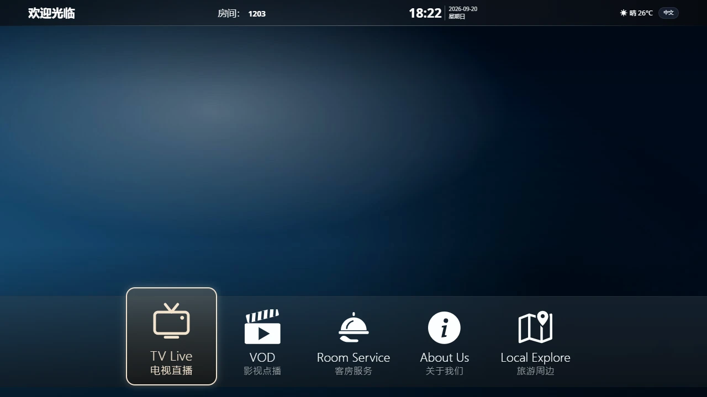
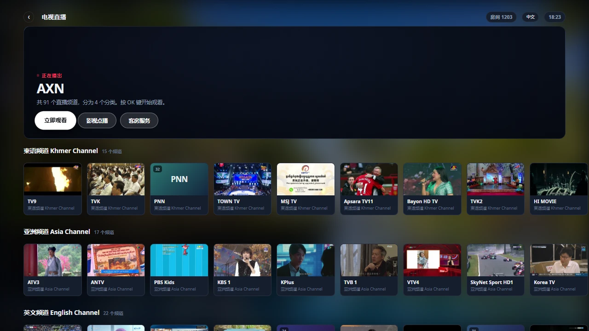
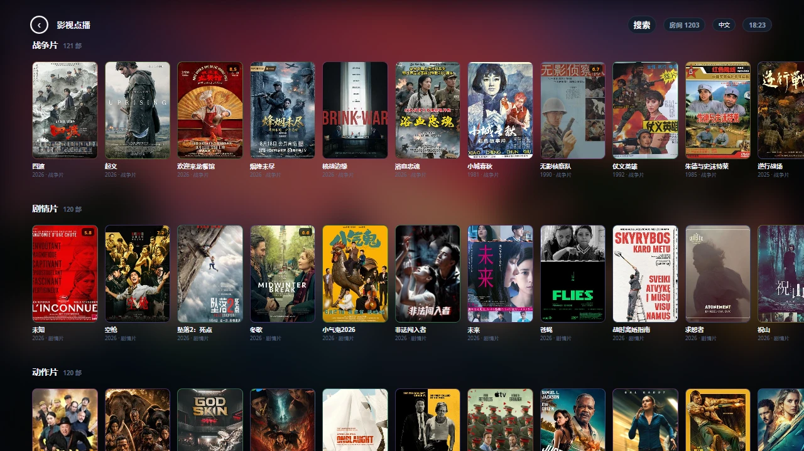
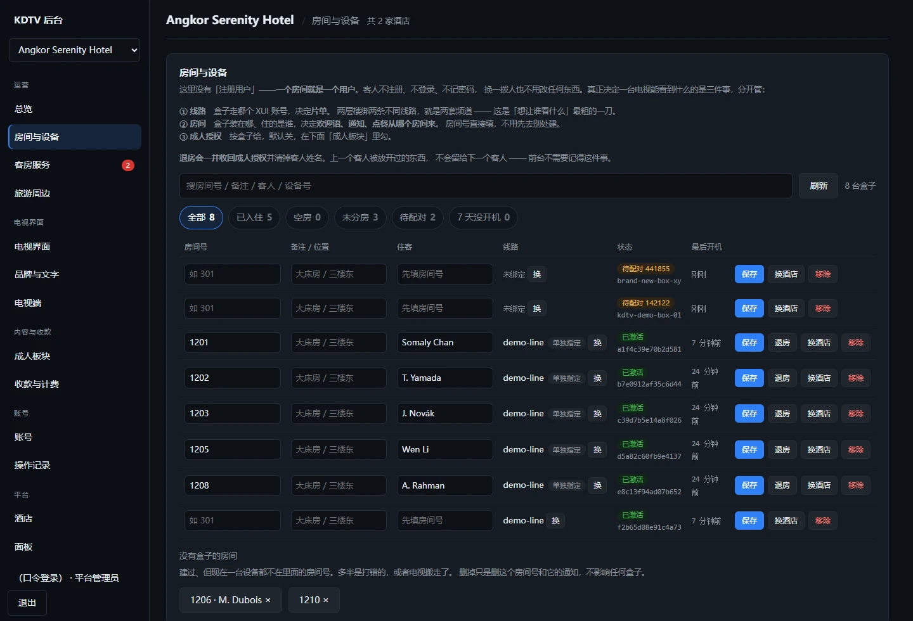
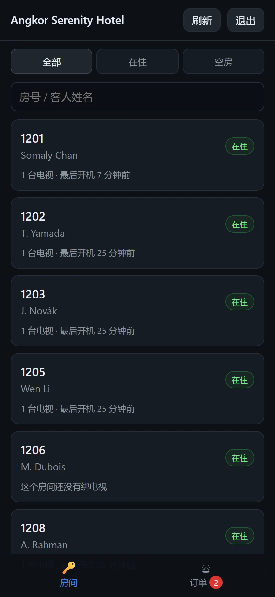

# KDTV — 酒店电视系统

给酒店客房做的机顶盒电视系统：**直播、点播、客房服务、旅游周边、按酒店分账**，
一套服务器管多家酒店。四种语言（中文 / English / ខ្មែរ / Indonesia），
全程遥控器操作。

盒子里装的 APK 只是一个壳，**界面和规则都在服务器上** ——
改菜单、改价格、换模板、换背景，部署一次服务器，所有电视十五分钟内自己换上，
不用碰任何一台电视。

```
                     ┌──────────────────────────┐
  ┌──────────┐       │  KDTV 服务器              │
  │ 安卓盒子 │──报到─▶│  房间 订单 收款 权限 多租户 │
  │ APK 薄壳  │◀─界面─│  电视界面 后台 前台手机页   │
  └────┬─────┘       └────────────┬─────────────┘
       │                          │ 只问元数据
       │                          ▼
       │             ┌──────────────────────────┐
       │             │  XUI.one 面板             │◀── 采集器 xui-collector
       │             │  直播 91 台 · 片库 6000+   │
       │             └────────────┬─────────────┘
       └──── 视频直连上游 CDN ─────┘
```

**视频不经过 KDTV 服务器。** 面板只回一个 302，盒子拿着它直接去上游取 ——
否则这台服务器的带宽就是整个系统的天花板。只有元数据走我们。

## 长什么样

<table>
<tr>
<td width="50%"><br><sub><b>首页</b> —— 底部导航每格两行：英文 + 客人选的语言</sub></td>
<td width="50%"><br><sub><b>直播</b> —— 卡片上那段会动的画面是预览图，不是第二条流</sub></td>
</tr>
<tr>
<td><br><sub><b>点播</b> —— 海报全部走我们自己的缓存</sub></td>
<td><br><sub><b>快进</b> —— 进度条是可聚焦元素，数字键跳片长百分比</sub></td>
</tr>
<tr>
<td><br><sub><b>后台</b> —— 一个房间就是一个用户</sub></td>
<td><br><sub><b>前台手机页</b> —— 站着用，一只手</sub></td>
</tr>
</table>

**[全部截图 →](docs/界面截图.md)**（电视、后台、前台、装机页，共 24 张）

> 截图里的酒店、房号、住客、订单、账号**全是编的**；成人板块那两张
> **在页面里就打了码**。说明见那一页开头。

## 从哪看起

| 想知道 | 看 |
| --- | --- |
| **这是什么、怎么运转、要改一件事该动哪个文件** | **[docs/系统总览.md](docs/系统总览.md)** ← 接手先看这个 |
| 各个界面长什么样 | [docs/界面截图.md](docs/界面截图.md) |
| 生意怎么转：从进一台盒子到客人看电视到钱进账 | [docs/业务流程.md](docs/业务流程.md)（面向运营） |
| 怎么部署、线上是什么样、踩过哪些坑 | [deploy/DEPLOY.md](deploy/DEPLOY.md) |
| 换原生播放内核值不值 | [shell/probe/RESULTS.md](shell/probe/RESULTS.md) |
| 播放引擎实测工装怎么用 | [shell/probe/README.md](shell/probe/README.md) |

## 目录

```
bff/          服务端（Node 20+ / Fastify / node:sqlite，无原生模块）
  src/            接口、房间、订单、收款、受限板块、多租户
  src/admin-ui/   后台（单文件，坐着用）
  src/desk-ui/    前台手机页（单文件，站着用）
  scripts/        五个自检脚本，改完必须跑
web/          电视界面（TypeScript + Vite，无框架）
shell/
  app/        安卓薄壳 APK（约 180 行 Kotlin，就是一个 WebView）
  probe/      播放引擎实测工装（不出包）
deploy/       Docker、nginx、部署文档
docs/         系统总览、业务流程、界面截图
  screenshots/  截图（示范数据）
```

影片和剧集由 `xui-collector`（另一个仓库）从资源站采进面板 ——
面板本身发来时目录是空的。

## 为什么是这个形状

三条需求塌缩成了同一个决定：**界面是服务端下发的 web bundle，APK 只是薄壳。**

- 要能跨平台 → 界面是网页
- 要能热更新 → 服务端部署一次，全部电视自己换上
- 客人不该输服务器地址 → APK 里只烧一个地址，别的全从那里取

代价是播放层受浏览器限制（少数源站不给跨域头，要绕一道中继）。
这个代价量过，结论在 [shell/probe/RESULTS.md](shell/probe/RESULTS.md)。

## 开发

```bash
# 服务端（默认 9081；没有 .env 也能起，所有配置都有能跑的默认值）
cd bff && npm install && npm run dev

# 电视界面
cd web && npm install && npm run dev
```

改完必须跑，**五个都要绿**：

```bash
cd bff
node scripts/selfcheck.js       # 88 项：收款、发货、防重复发货
node scripts/tenancy-check.js   # 142 项：A 店看不看得见 B 店的东西
node scripts/ui-check.js        #  6 项：后台/前台那两个单文件页面还能不能跑
node scripts/auth-check.js      # 49 项：角色能不能、票活不活、限速、记录
node scripts/api-auth-check.js  # 50 项：真起一个服务、真发 HTTP 去撞门
```

`tenancy-check` 尤其重要。多租户的错误**线上不会报错**，只会是 B 店的客人发现
电视上显示着别人家的名字，或者一家交了钱十家一起免费。只能靠主动去撞。

`ui-check` 补一个真实的洞：`/admin/` 和 `/desk/` 是「一个 HTML 里塞一整段
内联 JS」，没有构建步骤，**发布前没有任何东西会解析它**。写错一个字符，服务端
照样 200 把文件发出去，浏览器解析到那行就整段放弃 —— 页面一片空白，而所有
curl 检查全绿。真出过一次：少一个 `=`。

`api-auth-check` 和 `auth-check` 的分工：后者查规则本身，前者查**规则有没有真的
挂在路由前面** —— 两者差的正是「前台点不到」和「前台调不到」之间那道缝。

## 真实地址和口令

**不在这个仓库里。** 文档里的 `ott.example.com`、`<APP_HOST>`、`<PANEL_HOST>`、
`<LINE_USER>`、`example-upstream` 之类一律是占位符；真值在本机的
`deploy/SECRETS.local.md`（连同任何 `*.local.md` 都不进 git）。

签名钥匙也不在项目目录里 —— 每次部署都会把项目目录整个打包传到服务器，
签名钥匙没有任何理由出现在那里面。查找顺序见 `shell/app/build.gradle.kts`。

**签名钥匙丢了就再也发不出能覆盖升级的包** —— 只能一个房间一个房间地卸载重装。

## 许可证

**AGPL-3.0-or-later**（全文见 [LICENSE](LICENSE)，逐条的白话解释见 [NOTICE](NOTICE)）。

可以自由地用、改、部署，条件是三条：**保留作者和许可声明**、**改了要把源码给出去**、
**衍生作品也得是 AGPL**。

第二条对这套系统特别要紧。AGPL 第 13 条说的是：**把改过的版本架成网络服务给别人用，
用的人就有权拿到这个版本的完整源码。** 这套系统正好是这个形态 —— 服务端跑在你自己
机器上、酒店和客人通过网络用 —— 所以这不是边角条款，是核心约束。

**想闭源、想以专有产品或托管服务的形式卖而不公开改动、或者想去掉作者声明另行署名？**
AGPL 不允许，但我是唯一的版权持有人，**商业授权可以谈** —— 来找我聊。

## 联系

**Telegram：[@lngsuan](https://t.me/lngsuan)**

商业授权、部署咨询、找到 bug、想加个功能，都走这里。
